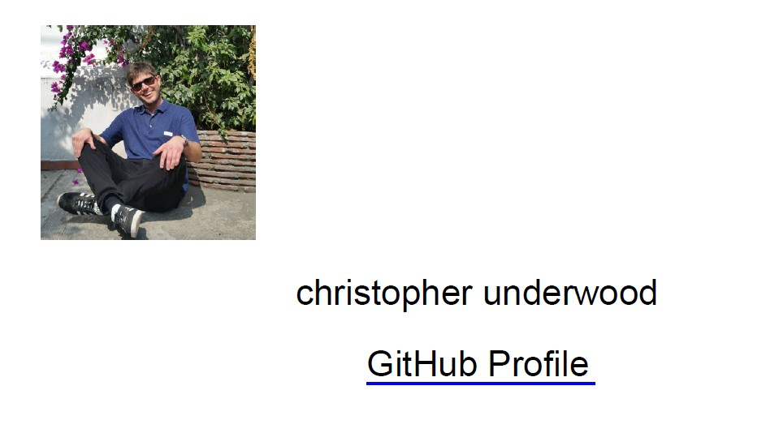

# Developer Profile Generator

**Description**
The developer profile generator is an application that generates a PDF resume based on information from a user's GitHub account.

**Motivation**
The goal of the program is to make it easier for a prospective employer to generate PDF resumes.

**User Story**
Given that I am someone interested in hiring a developer, I want a program that can take the a GitHub username and generate a simple PDF with basic information about the job applicant.

**Build status**

The build status is not complete. I attempted to render the GitHub information directly to a PDF versus generating an HTML page and then converting to a PDF document.

**Code style**

The application is written in JavaScript and node.js.

**Screenshots**


**Code Example**

```javascript
```

**Installation**

Project is hosted here: https://uchrissd.github.io/city-scout/
